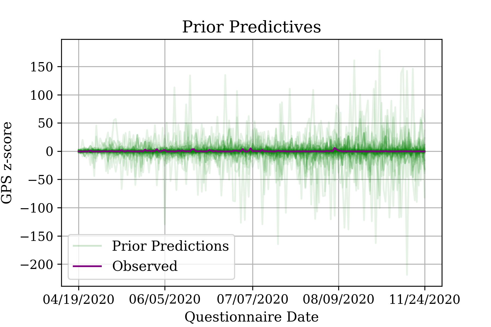
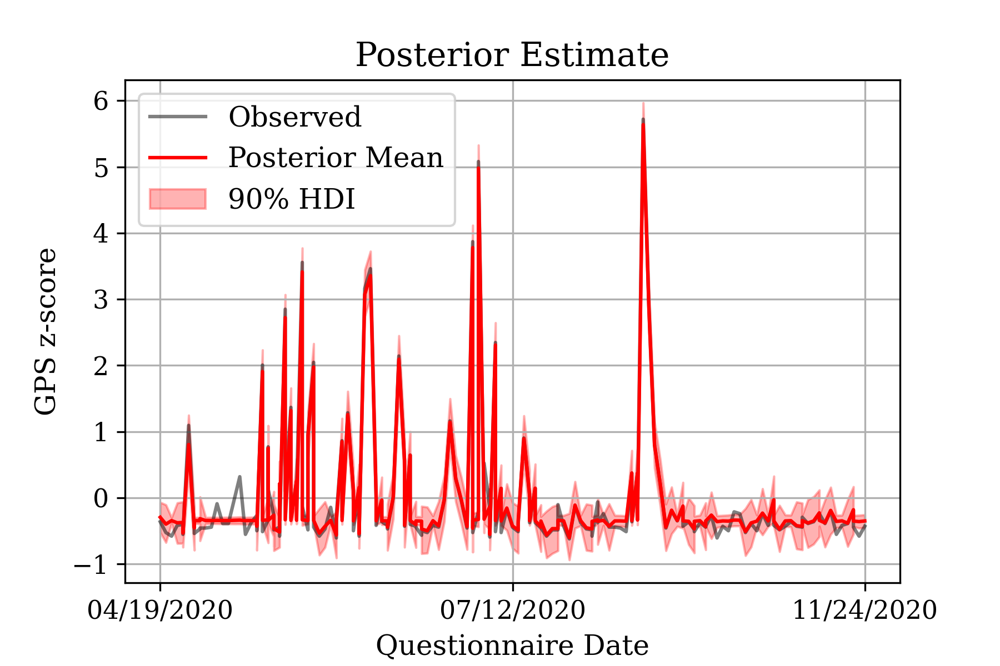
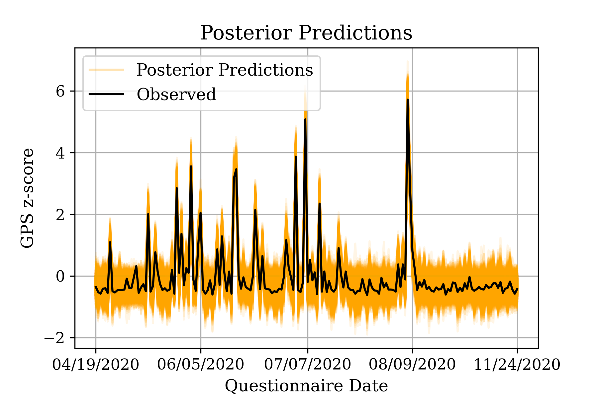
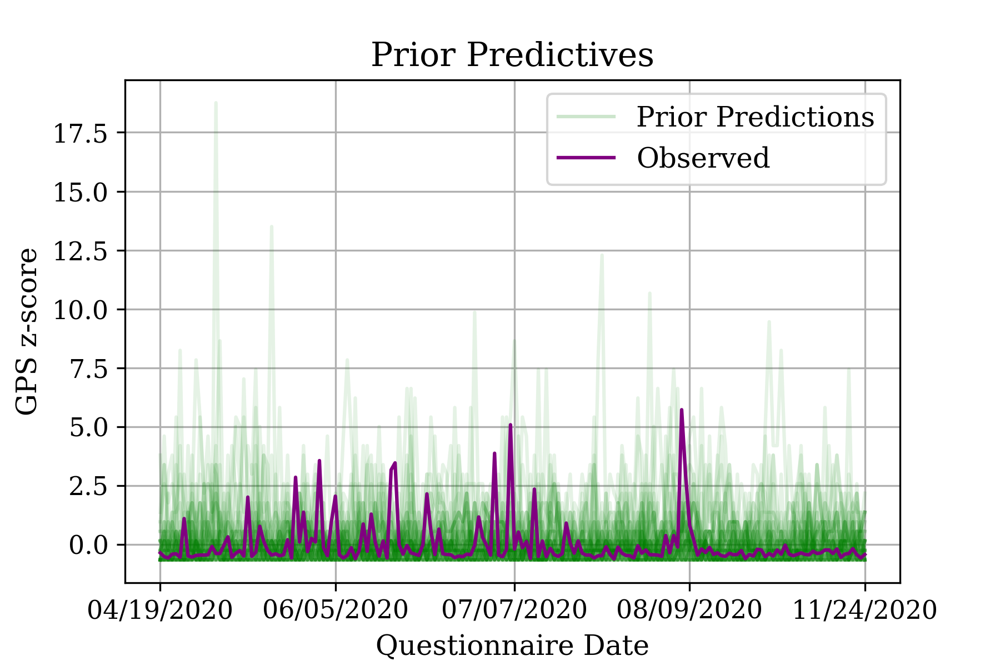
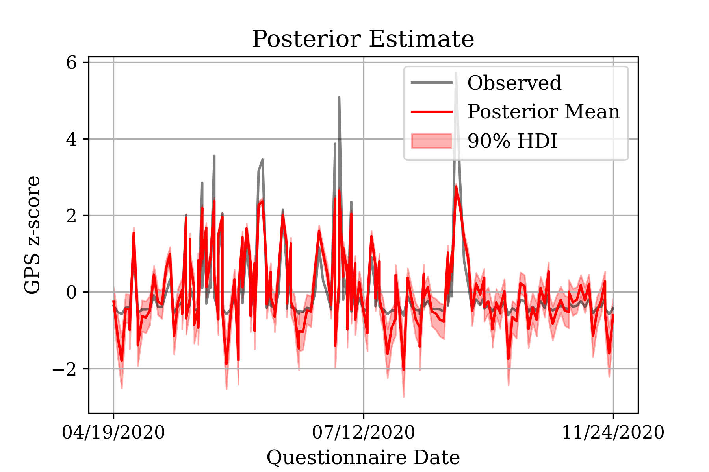
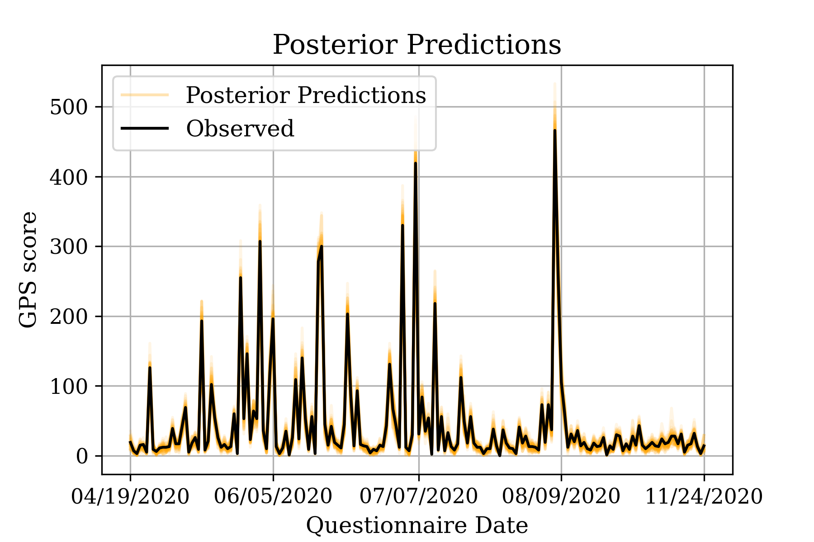

<h1> Gaussian Random Walk and Gaussian Process applied to Global Mental Health data </h1>

	The present repository contains results from spatiotemporal models applied to results from a mental health questionnaire used to asses mental health globally during the covid-19 pandemic (Olff et al., 2022). Models are simply a proof of concept, so they were applied to the south-American region only.

<h1> Model 1 </h1>

 The first model implements a multivariate Gaussian random walk (GRW) prior with an LKJ prior for covariances and correlations. 

 &#987; ~ HalfNormal(1) 

 L, R, SD ~ LKJ(n=E, &eta;=6, sd=&#987;)

 &Sigma; = LLT 

 wd,c ~ Normal(0,1) 

 &sigma; ~ HalfNormal(1) 

 td = &Sqrt;timed... &Sqrt;timeD 

 &beta;d,c = wd,ctd&sigma; 

 B = &Sigma;&beta;d,c 

 &alpha;c ~ Normal(0, 1) 

 &mu;c = &alpha;c + B 

 &varepsilon;c ~ HalfNormal(0.05) + 1 

 yd,c ~ Normal(&mu;d,c, &varepsilon;) 

 Where c…C , C = 7, is the number of countries, d…D, D = 178, is the number of dates when questionnaires were taken. Countries are only countries which provided data within the south-American region. Questionnaires were administered between April and November 2020 (i.e. dates). Note that the GRW is expressed as the product of a standard Gaussian w, a standard deviation &sigma;, and the square roots of times (see Morokof, 1998). 

  The model was sampled using Markov chain Monte Carlo (MCMC) No U-turn sampling (NUTS) with 2000 tuning steps, 2000 samples, 4 chains. 

<h1> Results </h1>

 Prior predictive checks are a bit wild, but models with narrower predictions sample worse. 

	

 Posterior estimates show a good approximation and uncertainty. 

	

 Predictions from the posterior also indicate sensible and reasonable uncertainty. 

	

<h1> Conclusion </h1>

 Although the model performs well in terms of inference and predictions, showing a reasonable/sensible measurement of uncertainty, the sampling is not ideal, with some parameters showing rather low ESS (above 200 but below 1000). 

<h1> Model 2  </h1>

 The second model implements a multivariate Gaussian process (GP) prior with an exponential quadratic covariance function. The model is intended for comparison, so it is rather simple. 

 &ell; ~ HalfNormal(1) 

 k(x, x') = exp[-(x,x')2/2&ell;2] 

 f(x) ~ GP(m(x), k(x, x'))

 &mu; = log(f(x)) 

 y ~ Poisson(&mu;) 

 Where k(x, x') is an exponential quadratic kernel covariance function, and m(x) is the mean function, x are the dates (sample points), and observed data (y) are the questionnaire aggregated scores. 

  The model was sampled using Markov chain Monte Carlo (MCMC) No U-turn sampling (NUTS) with 1000 tuning steps, 1000 samples, 4 chains, with ADVI initialization. 

<h1> Results </h1>

 Prior predictive checks are relatively reasonable. 

	

 Posterior estimates show a good approximation and uncertainty (both posterior and data were re-scaled to z-scores). 

	

 Predictions from the posterior seem to underestimate uncertainty in regions with low samples (i.e. dates/countries with fewer questionnaire data). 

	

<h1> Conclusion </h1>

 This model sampled better in terms (all ESS over 1000), and has the advantage of not requiring data transformation; namely questionnaire scores (added scores by country, counts) do not need to be transformed. However, predictions cannot properly account for higher uncertainty in regions with lower density. 

<h1> References </h1>

Morokoff (1998). Generating Quasi-Random Paths for Stochastic Processes . https://www.jstor.org/stable/2653031

Olff et al (2022). Mental health responses to COVID-19 around the world. https://doi.org10.1080/20008198.2021.1929754
